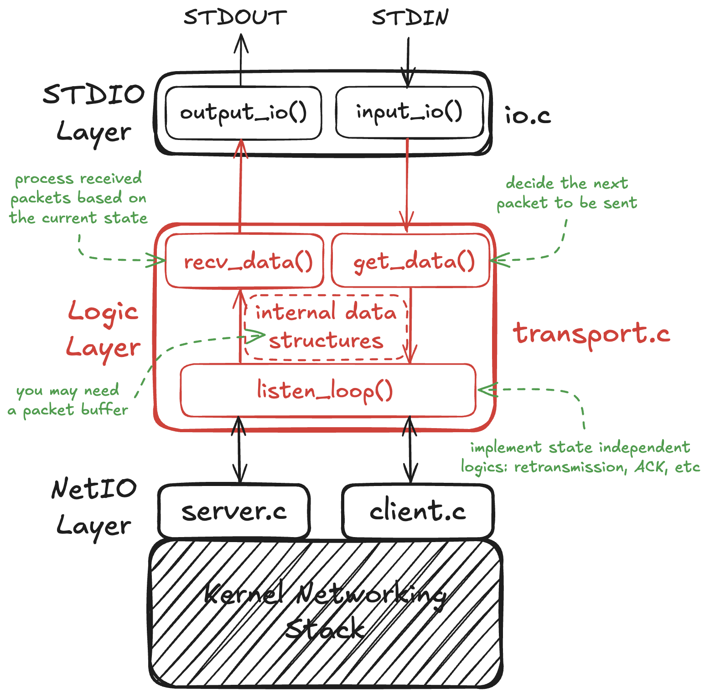

# CS 118 Spring 25 Project 1

This repository contains starter code for CS 118 Spring 25 Project
1.

The figure below illustrates the basic structure of the core files of skeleton code.
Please note that this is **purely informational** if you want to start the project from this skeleton.
After all, the autograder only needs a Makefile to compile binaries.
* Black parts (including the arrows) are what already provided and (technically) you don't have to modify them.
* Red parts (including the arrows) are components that you need to modify or create. They may not be the only things you need to implement, just "big necessary parts".
* Green parts are our suggestions. Again, purely informational and feel free to use your own way.

